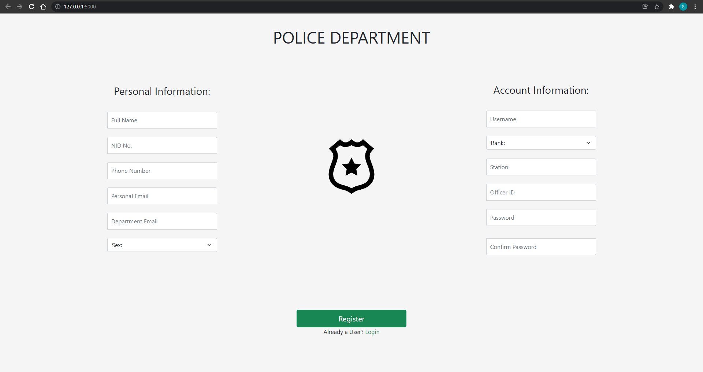
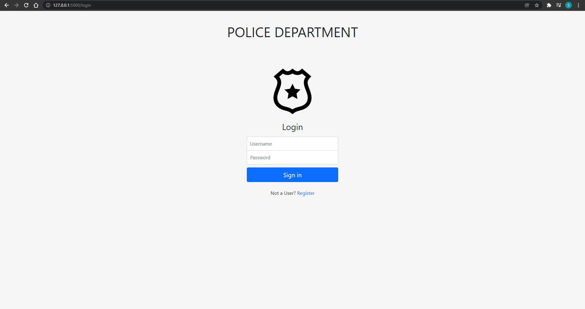
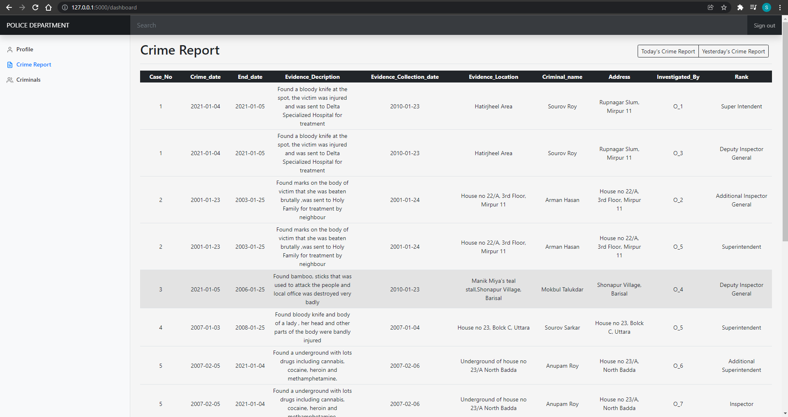
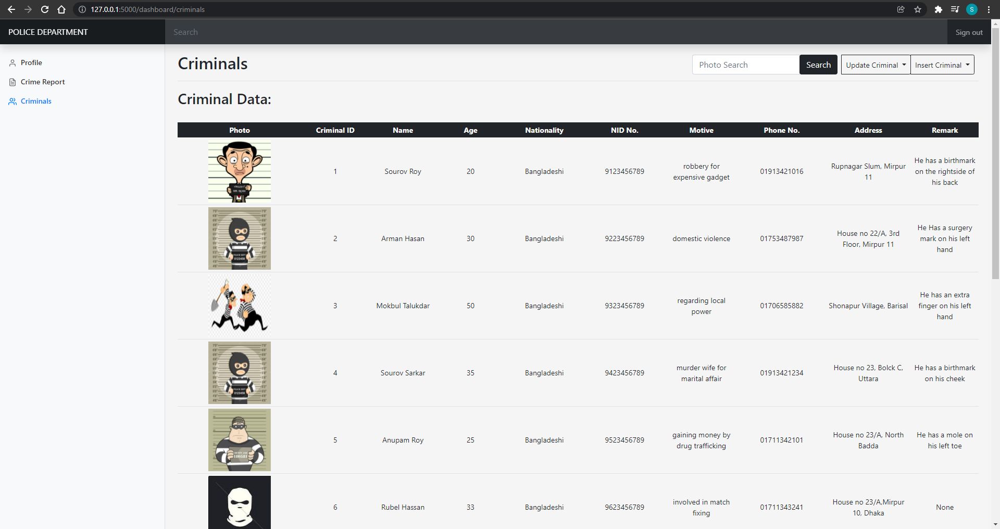
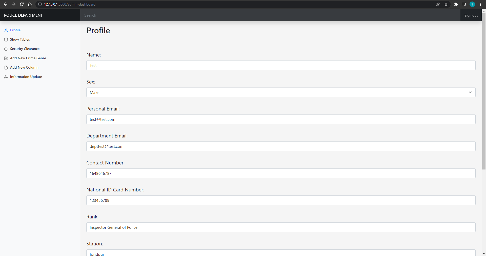

# Criminal Database for Police
A police website with a database(MySql) backend implemented using Flask-SqlAlchemy. Here, Officers can see the different crime reports made. Theres a clearance level assigned to Officers allowing highly sensitive cases to be only visible to allowed officers. Crime reports can be search by any query about the crime. There's also a list of criminal and certain criminal can be searched for. An alternate dashboard is available for admin users. They can update clearance level of officers, add new columns such as Crime type and tables to the database. This website is mainly for the police to keep track of crime reports, which officers is assigned to it, criminals, and any crime related information such as evidence collected, witness and their information etc.

## Register

## Login

## Officer Dashboard
>List of crime report and criminals can be sorted using any column.
### Crime Reports List

### Criminals List

## Admin Dashboard
